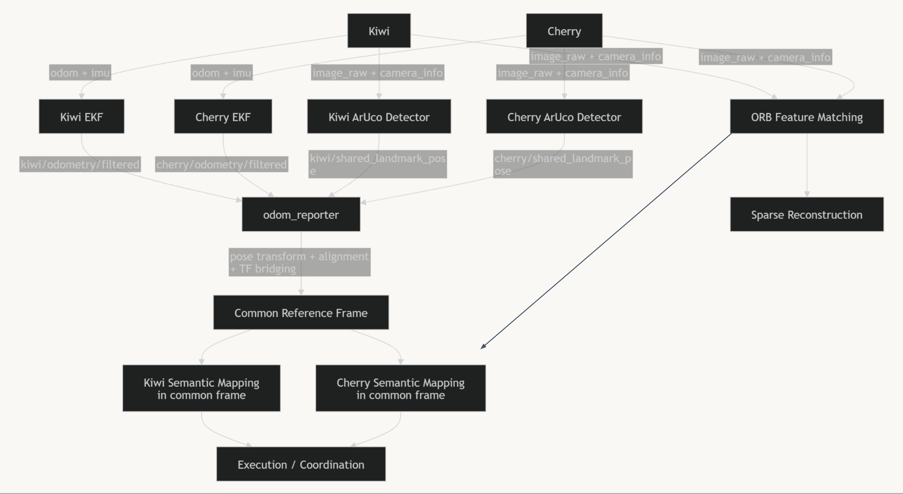
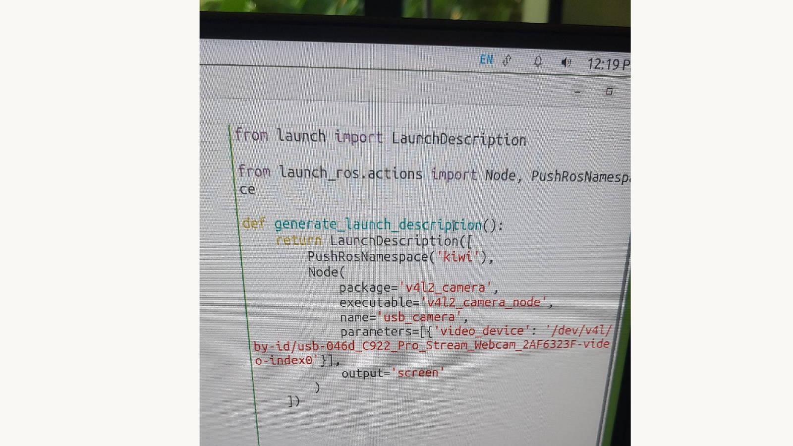

# Cooperative Visual Mapping and Navigation with Two TurtleBots

**EECS 106A Final Project - Team 8**  
**Team members:** Janus Sucharitakul, Ethan Gale, Kelvin Huang, Yhuin Ong  
**Project keywords:** multi-robot alignment, RGB-only perception, ArUco frame alignment, ORB/RANSAC visual correspondence, semantic occupancy mapping, greedy Bezier navigation

> **Website setup notes:** Replace every `TODO` link or image path with your final GitHub Pages assets. The images below assume you place the provided images in an `assets/` folder next to `index.html`.

---

## 1. Introduction

### End Goal

The goal of this project was to build a cooperative visual mapping and navigation system using two TurtleBots, named **Kiwi** and **Cherry**, equipped only with **Logitech C922 monocular RGB cameras**. The system was intentionally constrained to avoid LiDAR, dedicated depth cameras, motion-capture systems, or external localization. Instead, the robots had to use RGB camera streams, robot odometry, IMU/EKF pose estimates, ArUco marker observations, and classical computer vision to coordinate in a shared workspace.

At a high level, our final system aimed to:

1. bring up two physical TurtleBots under separate ROS 2 namespaces;
2. use a shared ArUco marker to align the robots into a common reference frame;
3. use ORB feature matching and RANSAC to find cross-robot visual correspondences and visualize sparse two-view reconstruction;
4. detect simple semantic obstacles, such as colored cones and dark obstacles, from RGB images;
5. maintain a lightweight 2D semantic occupancy grid in the common frame;
6. generate local Bezier waypoint paths through free or unknown space;
7. optionally follow the generated path with obstacle-aware velocity control.

The final project is best understood as a **role-configurable cooperative multi-robot perception and navigation prototype**. It does not claim to be a complete dense SLAM system or a globally consistent multi-robot map merger. Instead, it demonstrates the core infrastructure needed for two robots to share a reference frame, exchange visual information, reason about nearby obstacles, and perform local navigation using only consumer RGB cameras.

### Why This Project Is Interesting

Multi-robot systems are powerful because multiple robots can cover more space, observe the same scene from different viewpoints, and share information during navigation. However, this project is challenging because we restricted the hardware to inexpensive monocular RGB cameras. Without LiDAR or stereo depth cameras, the robots do not directly know the metric depth of obstacles. Without motion capture or external localization, they must estimate their relative frame alignment from their own sensors.

This creates several interesting robotics problems:

- **Multi-robot frame alignment:** Each robot begins with its own odometry frame. To coordinate, the robots need a way to express their poses in a shared frame.
- **Monocular perception:** A single RGB camera gives appearance but not direct depth. Obstacle positions must be approximated using camera geometry, image bounding boxes, and assumptions about the ground plane.
- **Cross-robot visual correspondence:** The robots may see overlapping parts of the environment from different angles. Feature matching must reject false matches and preserve only geometrically plausible correspondences.
- **Real-time navigation under uncertainty:** A fully merged global map is difficult to build reliably with noisy monocular data. The navigation system therefore needs to make local decisions that are robust enough for a live demo.
- **ROS 2 multi-robot integration:** Much of the default TurtleBot and camera bringup stack assumes one robot and one camera. Running two robots required careful use of namespaces, remappings, custom launch files, and camera device routing.

### Real-World Robotics Applications

The ideas in this project are useful in settings where low-cost robots need to coordinate without expensive sensors or infrastructure. Examples include:

- **Warehouse and inventory robots:** Multiple robots could share simple visual landmarks and semantic obstacle detections while navigating aisles.
- **Search and rescue:** Small robots could explore partially known environments where GPS, motion capture, or fixed localization infrastructure is unavailable.
- **Home and service robotics:** Low-cost indoor robots could use shared visual cues to coordinate cleaning, delivery, or monitoring tasks.
- **Agricultural or environmental monitoring:** Teams of small robots could use visual landmarks and semantic detections to coordinate coverage in constrained environments.
- **Education and prototyping:** The project shows how multi-robot perception, coordinate transforms, and local planning can be explored using accessible hardware.

---

## 2. Design

### Design Criteria

The project needed to satisfy several design criteria:

1. **RGB-only sensing:** The perception pipeline should work with Logitech C922 monocular RGB cameras and should not rely on LiDAR, stereo depth cameras, or external localization.
2. **Two-robot operation:** Kiwi and Cherry should run at the same time with separate ROS 2 namespaces, topics, and frames.
3. **Common-frame coordination:** The robots should be able to express their poses and observations in a shared reference frame, using Kiwi's odom frame as the common frame.
4. **Robustness over complexity:** The system should work reliably enough for a real demo, even if that means reducing the ambition of the original full SLAM architecture.
5. **Visual correspondence:** The system should demonstrate cross-robot visual matching using ORB features and RANSAC filtering.
6. **Lightweight semantic mapping:** The system should detect simple obstacle classes from RGB images and maintain a 2D occupancy representation.
7. **Local navigation:** The system should generate short, obstacle-aware Bezier paths and optionally publish velocity commands to follow them.
8. **Modularity:** Perception, alignment, mapping, planning, and control should be separated into ROS 2 nodes so that each component can be tested independently.

### Original Design

Our original project goal was more ambitious: each TurtleBot would run an independent RGB-based visual mapping pipeline, the robots would match features across their camera streams, and the system would merge the two local maps into a shared occupancy grid for downstream planning.

This design had three main stages:

1. **Independent visual mapping:** Each robot would build its own local visual map from its monocular camera.
2. **Multi-robot map alignment:** ORB features would be matched across robot camera streams, and RANSAC would verify whether two local maps should be connected.
3. **Common map and planning input:** The local maps would be merged into a shared occupancy representation used by a planner.

This architecture was conceptually attractive because it resembled a full cooperative SLAM system. However, it was too difficult to make reliable within the project timeline. Monocular map scale, noisy odometry, asynchronous image streams, feature-matching latency, and ROS 2 integration issues made a full global map merger fragile.

### Final Design Choice: Shared-Frame Local Semantic Navigation

We pivoted to a simpler but more reliable architecture. Instead of trying to maintain a dense globally consistent map, the final system uses a shared ArUco marker to initialize a common reference frame and then performs lightweight semantic mapping and local Bezier navigation inside that frame.



The final system has five main layers:

1. **Robot and camera bringup:** Kiwi and Cherry run under separate namespaces with separate image, camera info, odometry, IMU, and command topics.
2. **Pose filtering and frame alignment:** Each robot can run an EKF from `robot_localization`. A shared ArUco marker gives an initial geometric anchor so that Cherry's odom frame can be expressed in Kiwi's odom frame.
3. **Cross-robot visual matching:** ORB features are extracted from RGB images. A brute-force Hamming matcher proposes feature matches, and RANSAC filters geometrically inconsistent correspondences. The system publishes visual match diagnostics and optional sparse `PointCloud2` reconstruction.
4. **Semantic occupancy mapping:** RGB images are processed with HSV thresholds to detect colored cones and dark obstacles. Detections are projected into a 2D grid using approximate camera geometry and updated with log-odds evidence.
5. **Greedy Bezier navigation:** The mapper samples a fan of short Bezier curves, scores each path for novelty, clearance, goal progress, and turning cost, then publishes the best path. The follower uses a lookahead controller and recovery behavior to publish `cmd_vel`.

### Major Design Trade-Offs

#### Full global map vs. local semantic occupancy

A full global map would have been more impressive, but it would also require stable monocular SLAM, scale recovery, loop closure, and robust multi-robot map merging. We instead chose a local semantic occupancy grid. This reduced global consistency but improved real-time responsiveness and demo reliability.

#### Dense depth vs. sparse visual diagnostics

The ORB/RANSAC pipeline can triangulate sparse two-view feature points when both robots see overlapping features. However, this is not dense metric stereo and is not used as the main obstacle map for driving. We treat the sparse reconstruction as a visual diagnostic and as evidence of cross-robot correspondence, not as a complete depth sensor.

#### Deep learning detection vs. classical HSV detection

A learned detector could classify objects more robustly, but training or integrating one would add time and dependency risk. We used HSV thresholding for colored cones and dark obstacles because it is lightweight, inspectable, and easy to tune for a classroom demo.

#### Static planning vs. reactive Bezier planning

A static global planner would require a stable global map. Because our map and pose estimates are uncertain, the final system uses short-horizon Bezier paths. This is less globally optimal but more robust to local obstacle changes and localization drift.

#### Strict robot roles vs. role-configurable launch

The presentation often describes Kiwi as doing slightly more perception work and Cherry as the navigation robot. In the code, however, the mapper and follower are configurable by namespace, and the launch system can start mapping and following for either or both robots. This makes the final design more flexible than a hard-coded leader-follower split.

### Engineering Impact of the Design Choices

The final design improves **robustness** because it does not depend on a brittle full SLAM pipeline. It improves **efficiency** because semantic mapping and Bezier planning are lightweight enough to run online. It improves **debuggability** because each component publishes visual outputs such as debug images, occupancy grids, paths, match images, TF frames, and sparse point clouds.

The main cost is reduced **global accuracy**. The occupancy grid is approximate, the camera projection depends on tuned camera height and pitch, and the system cannot guarantee globally consistent maps across long trajectories. For a real deployment, these limitations would need to be addressed with better calibration, more robust object detection, improved state estimation, and stronger multi-robot map fusion.

---

## 3. Implementation

### Hardware

The hardware setup consisted of:

- two TurtleBots, named **Kiwi** and **Cherry**;
- one Logitech C922 RGB camera mounted on each robot;
- printed ArUco markers used as shared visual landmarks;
- colored cones and dark objects used as semantic obstacles;
- a computer running ROS 2, OpenCV, RViz, and the project launch files.

No LiDAR, dedicated depth camera, motion-capture system, or external localization system was used for the main perception and navigation pipeline.



### Software Packages

The main code is organized into two ROS 2 packages:

```text
src/multi_robot_slam/
src/ros2_aruco_interfaces/
```

The `multi_robot_slam` package contains the multi-robot launch file, ArUco detector, TF bridge, odom reporter, ORB feature matcher, semantic mapper, and Bezier follower. The `ros2_aruco_interfaces` package defines the custom ArUco marker message type used by the detector.

Important files include:

```text
run.sh
src/multi_robot_slam/launch/two_robots.launch.py
src/multi_robot_slam/config/kiwi_ekf.yaml
src/multi_robot_slam/config/cherry_ekf.yaml
src/multi_robot_slam/multi_robot_slam/ros2_aruco/aruco_detector.py
src/multi_robot_slam/multi_robot_slam/pose_reporter/odom_reporter.py
src/multi_robot_slam/multi_robot_slam/namespaced_tf_bridge.py
src/multi_robot_slam/multi_robot_slam/cv2_orb/orb_features.py
src/multi_robot_slam/multi_robot_slam/cv2_orb/semantic_bezier_mapper.py
src/multi_robot_slam/multi_robot_slam/cv2_orb/bezier_path_follower.py
```

### ROS 2 Multi-Robot Bringup

A major implementation task was getting two robots to run simultaneously. Many default examples assume a single robot and a single camera. We had to separate each robot's topics and frames using namespaces:

```text
/kiwi/image_raw
/kiwi/camera_info
/kiwi/odom
/kiwi/imu
/kiwi/cmd_vel

/cherry/image_raw
/cherry/camera_info
/cherry/odom
/cherry/imu
/cherry/cmd_vel
```

The launch file `two_robots.launch.py` declares launch arguments for robot namespaces, camera topics, camera info topics, ArUco startup, EKF startup, ORB startup, semantic mapper startup, and Bezier follower startup. The helper script `run.sh` builds the workspace, sources the install setup, launches the main system in tmux, starts ArUco detectors for both robots, and opens RViz for visualization.

Example launch configuration:

```bash
ros2 launch multi_robot_slam two_robots.launch.py \
  robot_a_namespace:=kiwi \
  robot_b_namespace:=cherry \
  robot_a_camera_topic:=image_raw \
  robot_b_camera_topic:=image_raw \
  robot_a_camera_info_topic:=camera_info \
  robot_b_camera_info_topic:=camera_info \
  start_ekf:=true \
  start_orb:=true \
  start_orb_reconstruction:=true \
  start_semantic_mapper:=true \
  start_semantic_mapper_for_cherry:=true \
  start_bezier_follower:=true
```

### ArUco Detection and Frame Alignment

Each robot runs an ArUco detector that subscribes to its image and camera info topics. The detector uses OpenCV ArUco detection and `solvePnP` to estimate the pose of a detected marker relative to the camera. When the marker is considered a shared landmark, the node publishes a `PoseStamped` message:

```text
/kiwi/shared_landmark_pose
/cherry/shared_landmark_pose
```

The `odom_reporter` node waits until both robots have observed the shared marker. It then estimates a planar transform between the two odometry frames and broadcasts a transform from Cherry's odom frame into Kiwi's odom frame. Kiwi's odom frame is treated as the common reference frame for RViz and for downstream mapping.

The same node also republishes each robot's pose in the common frame:

```text
/kiwi/ekf_pose_in_reference_odom
/cherry/ekf_pose_in_reference_odom
```

If EKF is disabled, the same structure can fall back to raw odometry-based common-frame pose topics.

### EKF Pose Estimation

The project includes separate EKF configuration files for Kiwi and Cherry. Each EKF runs in 2D mode and combines wheel odometry and IMU yaw-related information. The EKF publishes filtered odometry under each robot's namespace:

```text
/kiwi/odometry/filtered
/cherry/odometry/filtered
```

The EKF improves pose smoothness compared with raw odometry, but it does not eliminate drift. Since there is no external localization system, long-term pose error remains one of the main limitations of the system.

### ORB Feature Matching and Sparse Reconstruction

The `orb_features.py` node implements the cross-robot visual matching pipeline. It subscribes to images and camera info from both robots. Robot 1 frames are stored in a small database. When Robot 2 publishes a frame, the node extracts ORB keypoints and descriptors from the new frame, matches them against stored Robot 1 descriptors, and uses RANSAC homography fitting to count inliers.

The node publishes:

```text
/orb_features/place_match
/orb_features/image_matches
/orb_features/sparse_reconstruction
/orb_features/semantic_observations
```

The place match topic reports when a Robot 2 frame matches a prior Robot 1 frame with enough RANSAC inliers. The image match output helps debug feature correspondences. The sparse reconstruction output publishes a `PointCloud2` when there are enough geometrically consistent matches and camera intrinsics are available.

This component is important because it demonstrates that the two robots can recognize shared visual structure using only RGB imagery. However, this is not a dense depth map and is not used as the primary navigation map. It is a diagnostic for visual correspondence, relative camera geometry, and sparse two-view reconstruction.

### Semantic Obstacle Detection

The `semantic_bezier_mapper.py` node performs lightweight obstacle detection. It subscribes to a robot's RGB image and common-frame pose. It detects three cone-like color classes and dark obstacles:

```text
orange_cone
yellow_cone
blue_cone
dark_obstacle
```

The detector uses HSV thresholding and contour filtering. For each valid detection, the node estimates the obstacle's position relative to the robot using either a ground-plane projection or a bounding-box-height approximation. The estimated obstacle location is then transformed into the common map frame using the robot's current pose.

The semantic mapper publishes:

```text
/<robot>/semantic_mapper/debug_image
/<robot>/semantic_mapper/occupancy_grid
/<robot>/semantic_mapper/map_image
/<robot>/semantic_mapper/bezier_path
/<robot>/semantic_mapper/obstacles
```

The debug image shows the detected bounding boxes. The occupancy grid stores free, unknown, and occupied cells. The map image provides a visual version of the grid for debugging.

### Log-Odds Occupancy Grid

The semantic map is a 2D grid with configurable resolution, width, height, and origin. Unknown cells begin at `-1`. When the robot sees free space along a ray to a detected object, those cells receive negative log-odds evidence. When a detected obstacle is projected into the map, nearby cells receive positive log-odds evidence.

This representation is intentionally simple. It is not a full geometric map of the room, but it gives the planner enough local information to avoid recently detected obstacles and prefer less explored space.

### Greedy Bezier Path Planning

The semantic mapper also generates a local Bezier path. Instead of planning a complete route through a global map, the node samples a fan of short candidate Bezier curves in front of the robot. Each candidate path is scored using:

- novelty: whether the path moves into unknown or less explored cells;
- clearance: whether the path stays away from occupied cells;
- goal progress: whether the path moves generally toward a fallback goal;
- turn penalty: whether the path requires a sharp heading change;
- hysteresis: whether the path avoids sudden oscillation between headings.

The best candidate is published as a `nav_msgs/Path`.

### Bezier Path Follower

The `bezier_path_follower.py` node consumes the generated path, robot pose, occupancy grid, ArUco pose, and alignment status. It publishes velocity commands to the robot:

```text
/<robot>/cmd_vel
```

The follower includes several safety and robustness behaviors:

1. It waits for pose and path messages before moving.
2. It can require ArUco alignment before motion begins.
3. It performs a short initial side-departure turn after alignment.
4. It chooses a lookahead point on the Bezier path.
5. It computes linear and angular velocity toward that lookahead point.
6. It checks the occupancy grid in front of the robot.
7. If an obstacle is too close, it stops, backs up, turns, and retries.
8. If the path becomes stale, it stops instead of driving blindly.

This controller is closer to a lightweight pure-pursuit and recovery controller than to MPC. A full MPC controller would be a future improvement, not a feature of the current implementation.

### Complete System Flow

The full system works as follows:

1. The workspace is built and sourced.
2. Kiwi and Cherry are launched under separate namespaces.
3. Each robot publishes camera images, camera calibration, odometry, and IMU information.
4. Optional EKF nodes publish filtered odometry for both robots.
5. Each robot's ArUco detector estimates the pose of the shared marker.
6. The odom reporter computes a planar transform from Cherry's odom frame into Kiwi's odom frame.
7. Common-frame robot poses are published for downstream mapping and visualization.
8. ORB features are extracted from both robots' RGB streams.
9. RANSAC filters ORB matches and publishes visual match diagnostics and optional sparse reconstruction.
10. Semantic mappers detect cones and dark obstacles from RGB images.
11. Detections are projected into the shared frame and accumulated in local occupancy grids.
12. The mapper samples and scores Bezier paths.
13. The follower optionally drives the robot along the selected path while checking for obstacles and performing recovery if blocked.
14. RViz visualizes TF frames, robot paths, ArUco landmarks, occupancy information, Bezier paths, and sparse reconstruction.

---

## 4. Results

### What Worked

The completed system demonstrated the main building blocks of cooperative visual navigation:

- two physical TurtleBots could be launched with separate namespaces;
- both robots could use Logitech C922 RGB cameras as their primary visual sensors;
- ArUco detection provided a shared visual landmark for frame alignment;
- the odom reporter expressed both robots in Kiwi's odom frame;
- ORB and RANSAC detected cross-robot visual correspondences and filtered false matches;
- sparse two-view reconstruction could be visualized as a diagnostic point cloud;
- RGB-based semantic detection identified colored cones and dark obstacles;
- semantic detections were accumulated into a 2D occupancy grid;
- Bezier waypoint paths were generated from the semantic map;
- the follower could publish velocity commands and stop or recover when the map indicated a nearby obstacle.

The strongest result was not a perfect global map. The strongest result was that the team successfully integrated multiple difficult subsystems - multi-robot ROS 2 bringup, RGB perception, shared-frame alignment, visual matching, mapping, planning, and control - into one coherent prototype.

### Pictures and Visualizations

**System architecture:**


**TODO: Add final RViz screenshot here**


### Video

<div class="video-block">
  <p><strong>Demo video:</strong>
    <a href="https://youtube.com/shorts/IdI-ieeSuZ4">
      Watch our project in action
    </a>
  </p>

  <iframe
    width="800"
    height="450"
    src="https://www.youtube.com/embed/IdI-ieeSuZ4"
    title="Team 8 Demo Video"
    frameborder="0"
    allowfullscreen>
  </iframe>
</div>


---

## 5. Conclusion

### How Well the Project Met the Design Criteria

The final system met the most important design criteria for a working prototype. It used only RGB cameras, ran two TurtleBots under separate namespaces, aligned their frames using a shared ArUco marker, demonstrated ORB/RANSAC visual matching, built a lightweight semantic occupancy grid, and generated local Bezier paths for navigation.

The project did not fully meet the original goal of building a merged global visual map from two independent monocular SLAM pipelines. That original goal turned out to be too ambitious for the available time and hardware constraints. However, the pivot was successful because it preserved the key cooperative robotics ideas while producing a more reliable and explainable system.

### Difficulties Encountered

#### Multi-robot hardware setup

The first major difficulty was simply running two TurtleBots at the same time. Much of the default setup code assumed one robot and one camera. We had to work through namespaces, ROS domain behavior, camera driver paths, and topic remappings. Camera device routing was especially painful because both webcams could not be treated as the same default device.

#### Coordinate drift

Without external localization, both robots accumulate odometry drift. EKF filtering helps, but it does not solve the fundamental drift problem. The shared ArUco marker provides an initial alignment anchor, but maintaining highly accurate relative pose over longer motion remains difficult.

#### Monocular depth ambiguity

A monocular RGB camera does not directly give distance. We used geometric approximations based on camera height, pitch, field of view, ground-plane projection, and bounding box height. These approximations work for a controlled demo, but they are sensitive to calibration and object geometry.

#### Feature matching latency and fragility

ORB/RANSAC matching is useful for visual correspondence and sparse reconstruction, but it is not always fast or stable enough to drive the entire navigation stack. We therefore kept it as a diagnostic and supplementary visual-matching module rather than relying on it as the only map source.

#### Routing inflexibility

The original shared global map and static planning approach was not responsive enough to dynamic obstacles or pose errors. This motivated the switch to local semantic maps and greedy Bezier paths.

### Flaws, Hacks, and Limitations

The final prototype has several limitations:

- The system does not build a dense 3D map.
- The system does not maintain a fully optimized global pose graph.
- ORB/RANSAC does not continuously correct the EKF or eliminate odometry drift.
- Sparse two-view reconstruction is a diagnostic, not a metric depth map for planning.
- HSV thresholding is sensitive to lighting and object color.
- Camera height, pitch, and projection parameters need careful tuning.
- The occupancy grid is local and approximate, not a complete map of the room.
- The Bezier follower is a lightweight local controller, not a full MPC controller.
- Coordinated motion is still loosely coupled rather than fully peer-to-peer.

### Future Improvements

With more time, the most valuable improvements would be:

1. **Better mapping accuracy:** Improve camera calibration, scale handling, and global map consistency.
2. **More robust object detection:** Replace or supplement HSV thresholds with a trained object detector.
3. **Closed-loop visual localization:** Use visual correspondences to reduce drift more directly instead of only visualizing matches.
4. **Better multi-robot coordination:** Move from loosely coupled roles to true peer-to-peer collaborative planning.
5. **MPC or stronger local control:** Replace the simple Bezier follower with a full model-predictive controller for smoother and faster motion.
6. **Dynamic obstacle tracking:** Track moving obstacles over time instead of only marking local occupancy.
7. **Improved demo tooling:** Add launch presets, parameter files, and scripts for easier setup in different rooms.

---

## 6. Team

> **TODO:**

### Janus Sucharitakul

Janus worked on ...

### Ethan Gale

Ethan worked on ...

### Kelvin Huang

Kelvin worked on ...

### Yhuin Ong

Yhuin worked on ...

---

## 7. Additional Materials

### Code Repository

**GitHub repository:** [TODO: paste public GitHub repository link](TODO_PASTE_GITHUB_REPO_LINK_HERE)

### Key Code Files

```text
Final project/run.sh
Final project/src/multi_robot_slam/launch/two_robots.launch.py
Final project/src/multi_robot_slam/config/kiwi_ekf.yaml
Final project/src/multi_robot_slam/config/cherry_ekf.yaml
Final project/src/multi_robot_slam/multi_robot_slam/ros2_aruco/aruco_detector.py
Final project/src/multi_robot_slam/multi_robot_slam/pose_reporter/odom_reporter.py
Final project/src/multi_robot_slam/multi_robot_slam/namespaced_tf_bridge.py
Final project/src/multi_robot_slam/multi_robot_slam/cv2_orb/orb_features.py
Final project/src/multi_robot_slam/multi_robot_slam/cv2_orb/semantic_bezier_mapper.py
Final project/src/multi_robot_slam/multi_robot_slam/cv2_orb/bezier_path_follower.py
Final project/src/ros2_aruco_interfaces/msg/ArucoMarkers.msg
```

### Launch and Run Instructions

A typical workflow is:

The provided `run.sh` script automates a fuller tmux-based launch that starts the main system, separate ArUco detectors for Kiwi and Cherry, and RViz.

### Hardware and Component References

- Two TurtleBot robots
- Logitech C922 RGB webcams
- Printed ArUco markers
- Colored cones and dark obstacle objects
- ROS 2
- OpenCV
- RViz
- `robot_localization` EKF package

### Presentation slides:

 - [Google Slides Presentation](https://docs.google.com/presentation/d/1cBIB4ztT8RqXpRIiAGmnrTajGa6IkmavPpeQABbGh9Y/edit?usp=sharing)

---

## Acknowledgments

This project was completed for EECS 106A. The system builds on course concepts in robot frames, transforms, state estimation, visual perception, feature matching, geometric verification, mapping, and control.
